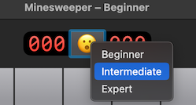
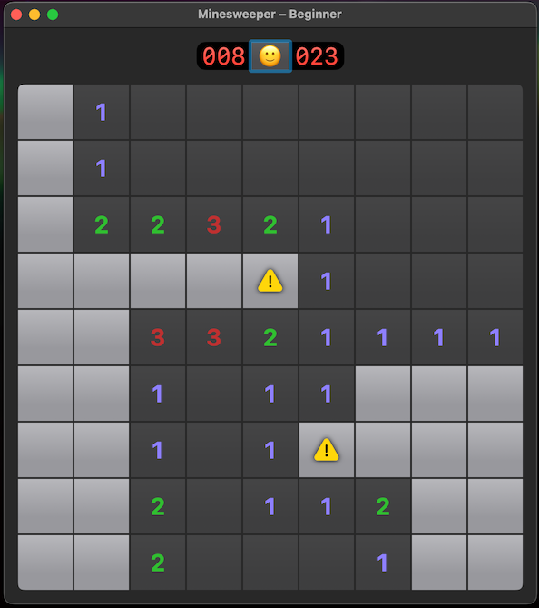

# Minesweeper

The game for macOS written using SwiftUI, visually inspired by Microsofts classic Minesweeper (but using dark mode).
Implemented along the [HWS+](https://www.hackingwithswift.com/plus/) live stream by Paul Hudson.

## Features

- Click/press to reveal the square below the cursor
- Hold/long press to flag a square for a possible mine
- Choose between three difficulty levels: Beginner, Intermediate and Expert
  
  

## Screenshots

